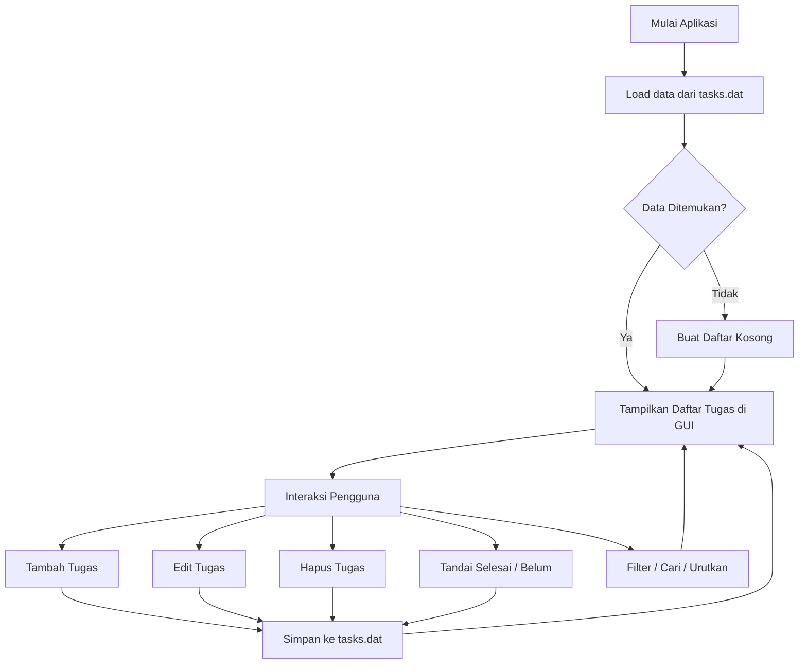

# 📋 Todo List with Countdown

Aplikasi manajemen tugas kuliah berbasis desktop yang dibangun menggunakan **Java Swing**.

## Fitur
- Tambah tugas dengan atau tanpa deadline
- Kolom **Catatan** untuk keterangan tambahan
- Tombol **Edit** langsung di setiap kartu tugas
- Hitung mundur (countdown) real-time
- Toggle selesai via checkbox, double-click, atau tombol
- Pencarian, filter, dan pengurutan tugas
- Penyimpanan otomatis ke `tasks.dat`

## Cara Menjalankan

```bash
# Kompilasi
javac 04_docs/TodoApp.java

# Jalankan
java -cp 04_docs TodoApp
```

> Atau masuk ke folder `04_docs` terlebih dahulu:
> ```bash
> cd 04_docs
> javac TodoApp.java
> java TodoApp
> ```

## Struktur dan Penjelasan File

Aplikasi ini memiliki beberapa komponen file sebagai berikut:

- **`TodoApp.java`**: File sumber (source code) utama berbahasa Java. Di sinilah semua logika OOP dan desain antarmuka aplikasi Todo List dibuat.
- **File `.class` (seperti `TodoApp.class`, `Task.class`, `TodoGUI$TaskCellRenderer.class`)**: Merupakan file *bytecode* hasil kompilasi dari Java. File ini dibaca dan dieksekusi oleh Java Virtual Machine (JVM). Tanda `$` menunjukkan *Inner Class* atau *Anonymous Class*.
- **`Buku_Panduan_TodoApp.docx/pdf`**: Panduan langkah demi langkah bagi pengguna akhir (user) untuk mengoperasikan aplikasi Todo List.
- **`Laporan_Tugas_OOP_TodoApp.docx/pdf`**: Laporan akademik/tugas kuliah yang menjabarkan teori, struktur kode, dan pemenuhan tugas OOP pada aplikasi ini.
- **`Screenshot ... .png`**: Gambar-gambar tangkapan layar antarmuka aplikasi yang digunakan sebagai lampiran pada Buku Panduan maupun Laporan.
- **`README.md`**: File ini sendiri, memberikan gambaran umum tentang proyek, cara menjalankan, dan dokumentasinya.
- **`.gitignore`**: Aturan agar file hasil *build* atau ekstensi tertentu tidak ikut diunggah ke repositori Git.

## Alur Kerja Aplikasi (Flowchart)



## Penerapan Konsep Pemrograman Berorientasi Objek (OOP)

Aplikasi ini mengimplementasikan prinsip dasar OOP untuk mempermudah pengembangan dan pemeliharaan kode. Berikut adalah rincian per baris kodenya di dalam file `04_docs/TodoApp.java` beserta kaitannya dengan hasil kompilasi:

### 1. Encapsulation (Pengkapsulan)
**Posisi di Kode: Baris ke-24 s.d. 28 (Di dalam `class Task`)**
```java
// [OOP CONCEPT: ENCAPSULATION]
private final int id;
private String description;
private String notes;
private LocalDateTime deadline;
private boolean completed;
```
Semua atribut atau data pembentuk tugas dilindungi dengan modifier `private`. Ini berarti kelas lain tidak bisa sembarangan mengubah data tugas dari luar. Untuk memperbarui data, harus melalui prosedur resmi, yaitu menggunakan *method* publik seperti `update(...)` atau `toggleCompleted()`. 
*Kaitan dengan file kompilasi:* Kelas ini dikompilasi berdiri sendiri menjadi file **`Task.class`**.

### 2. Abstraction (Abstraksi)
**Posisi di Kode: Baris ke-84 s.d. 87 (Di dalam `class TodoList`)**
```java
// [OOP CONCEPT: ABSTRACTION]
private List<Task> tasks;
private int nextId;
private static final String FILE_NAME = "tasks.dat";
```
Melalui kelas `TodoList`, kami menyembunyikan kerumitan membaca (*load*) dan menyimpan (*save*) file biner ke dalam penyimpanan fisik laptop. Kelas antarmuka (`TodoGUI`) tidak perlu memikirkan kerumitan I/O. Saat menambahkan tugas, GUI cukup memanggil fungsi abstrak yang simpel: `todoList.addTask(...)`.
*Kaitan dengan file kompilasi:* Logika terpusat ini dikompilasi menjadi **`TodoList.class`**.

### 3. Inheritance (Pewarisan)
**Posisi di Kode: Baris ke-699 (Di dalam `class TodoGUI`)**
```java
// [OOP CONCEPT: INHERITANCE]
private static class TaskCellRenderer extends JPanel implements ListCellRenderer<Task> {
```
Kami tidak membuat desain kartu daftar tugas (*list item*) dari awal, melainkan mewarisinya (*extends*) dari kelas bawaan Java Swing yaitu `JPanel`. Kelas `TaskCellRenderer` otomatis mewarisi seluruh kemampuan panel grafis.
*Kaitan dengan file kompilasi:* Karena ini ditulis sebagai *Inner Class* (kelas di dalam kelas `TodoGUI`), Java memisahkannya dengan nama **`TodoGUI$TaskCellRenderer.class`**.

### 4. Polymorphism (Polimorfisme)
**Posisi di Kode: Baris ke-739 (Di dalam `TaskCellRenderer`)**
```java
// [OOP CONCEPT: POLYMORPHISM]
@Override
public Component getListCellRendererComponent(...) {
```
Java Swing secara bawaan tidak tahu cara menampilkan objek `Task`. Oleh karena itu, kami menimpa (*override*) fungsi bawaan `getListCellRendererComponent`. Saat program berjalan, fungsi kustom kami akan dipanggil secara **polimorfik** untuk menghasilkan tampilan yang dicoret saat selesai atau merah saat terlambat.

### 5. Kombinasi Lanjut: Anonymous Class (Inheritance & Polymorphism)
**Posisi di Kode: Baris ke-336 s.d. 340**
```java
// [OOP CONCEPT: INHERITANCE & POLYMORPHISM]
taskList.addMouseListener(new java.awt.event.MouseAdapter() {
    @Override
    public void mouseClicked(java.awt.event.MouseEvent e) {
```
Kami menggabungkan *Inheritance* dan *Polymorphism* menggunakan *Anonymous Inner Class* (Kelas tanpa nama). Kami **mewarisi** kelas `MouseAdapter` sekaligus me-**override** fungsi `mouseClicked` agar memiliki perilaku pendeteksian kustom.
*Kaitan dengan file kompilasi:* Karena tidak bernama, Java menamainya dengan angka secara otomatis, misalnya: **`TodoGUI$1.class`**, **`TodoGUI$2.class`**, dst.

---

## Teknologi
- **Java Swing** — antarmuka desktop
- **Java Serialization** — penyimpanan data lokal
- **OOP** — Encapsulation, Abstraction, Inheritance, Polymorphism

## Kelompok 5 — Kelas 4ITB1
- Muhammad Alfatih (224140248)
- Mochammad Saiful Rizal (224140252)

Institut Teknologi dan Bisnis Widyagama Lumajang — 2025/2026
