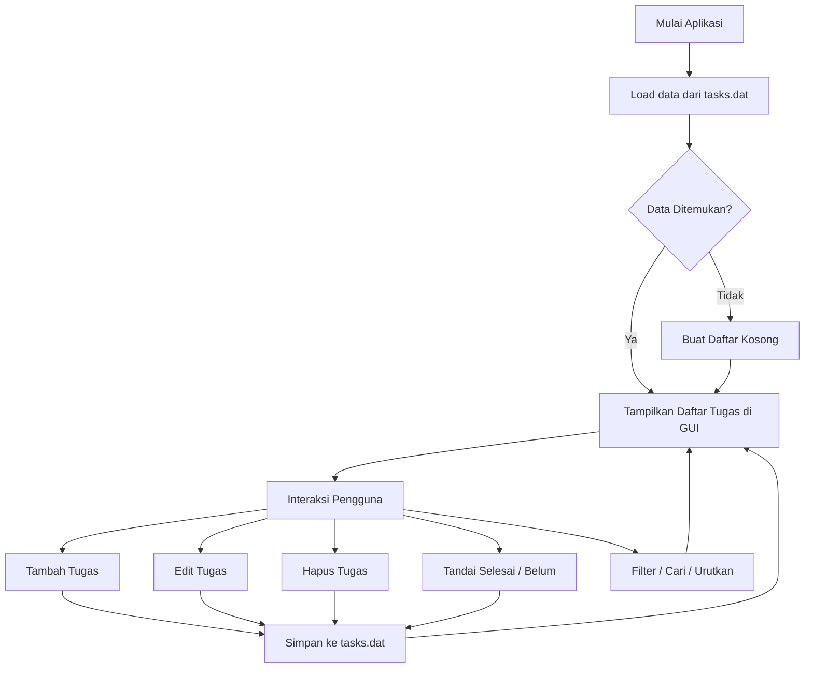

# 📋 Todo List with Countdown

Aplikasi manajemen tugas kuliah berbasis desktop yang dibangun menggunakan **Java Swing**.

## Fitur
- Tambah tugas dengan atau tanpa deadline
- Kolom **Catatan** untuk keterangan tambahan
- Tombol **Edit** langsung di setiap kartu tugas
- Hitung mundur (countdown) real-time
- Toggle selesai via checkbox, double-click, atau tombol
- Pencarian, filter, dan pengurutan tugas
- Penyimpanan otomatis ke `tasks.dat`

## Cara Menjalankan

```bash
# Kompilasi
javac 04_docs/TodoApp.java

# Jalankan
java -cp 04_docs TodoApp
```

> Atau masuk ke folder `04_docs` terlebih dahulu:
> ```bash
> cd 04_docs
> javac TodoApp.java
> java TodoApp
> ```

## Struktur dan Penjelasan File

Aplikasi ini memiliki beberapa komponen file sebagai berikut:

- **`TodoApp.java`**: File sumber (source code) utama berbahasa Java. Di sinilah semua logika OOP dan desain antarmuka aplikasi Todo List dibuat.
- **File `.class` (seperti `TodoApp.class`, `Task.class`, `TodoGUI$TaskCellRenderer.class`)**: Merupakan file *bytecode* hasil kompilasi dari Java. File ini dibaca dan dieksekusi oleh Java Virtual Machine (JVM). Tanda `$` menunjukkan *Inner Class* atau *Anonymous Class*.
- **`Buku_Panduan_TodoApp.docx/pdf`**: Panduan langkah demi langkah bagi pengguna akhir (user) untuk mengoperasikan aplikasi Todo List.
- **`Laporan_Tugas_OOP_TodoApp.docx/pdf`**: Laporan akademik/tugas kuliah yang menjabarkan teori, struktur kode, dan pemenuhan tugas OOP pada aplikasi ini.
- **`Screenshot ... .png`**: Gambar-gambar tangkapan layar antarmuka aplikasi yang digunakan sebagai lampiran pada Buku Panduan maupun Laporan.
- **`README.md`**: File ini sendiri, memberikan gambaran umum tentang proyek, cara menjalankan, dan dokumentasinya.
- **`.gitignore`**: Aturan agar file hasil *build* atau ekstensi tertentu tidak ikut diunggah ke repositori Git.

## Alur Kerja Aplikasi (Flowchart)



## Penerapan Konsep Pemrograman Berorientasi Objek (OOP)

Aplikasi ini mengimplementasikan prinsip dasar OOP untuk mempermudah pengembangan dan pemeliharaan kode:

### 1. Encapsulation (Pengkapsulan)
**Konsep:** Menyembunyikan atribut dari akses langsung dan hanya membukanya melalui metode resmi (*getter/setter*).

**Implementasi:** Pada kelas `Task`, variabel seperti `description`, `notes`, `deadline`, dan `completed` diatur menjadi `private`. Modifikasi hanya bisa dilakukan lewat metode `public` seperti `update()`, `toggleCompleted()`, atau untuk mengambil nilainya lewat `getDescription()`.

### 2. Abstraction (Abstraksi)
**Konsep:** Menyembunyikan detail kerumitan logika internal dari antarmuka agar mudah digunakan.

**Implementasi:** Kelas `TodoList` menangani manajemen tugas (List) dan input/output penyimpanan data (`tasks.dat`). Antarmuka `TodoGUI` hanya cukup memanggil metode `todoList.addTask(...)` secara abstrak, tanpa perlu memikirkan dan mengetahui bagaimana data tersebut ditulis ke memori fisik komputer secara spesifik.

### 3. Inheritance (Pewarisan)
**Konsep:** Mewarisi fungsi dari kelas yang sudah ada sehingga tidak perlu menulis ulang kode.

**Implementasi:** `TaskCellRenderer` di-buat dengan mewarisi kelas `JPanel` (`extends JPanel`). Dengan ini, `TaskCellRenderer` otomatis memiliki semua kemampuan layaknya panel grafis bawaan Java, yang lalu kita tambahkan tombol dan label kustom di atasnya. Selain itu juga ada pewarisan melalui *Anonymous Class* seperti mewarisi `MouseAdapter` untuk kontrol klik.

### 4. Polymorphism (Polimorfisme)
**Konsep:** Kemampuan kelas untuk menimpa fungsionalitas induk dengan perilakunya sendiri.

**Implementasi:** Dilakukan melalui fungsi *Overriding*. Contoh utamanya adalah ketika `TaskCellRenderer` menimpa fungsi `getListCellRendererComponent(...)`. Sehingga ketika `JList` milik Java melakukan pemanggilan gambar (*render*), fungsi kustom kita yang dieksekusi, menghasilkan tampilan kartu daftar kustom. 

---

## Teknologi
- **Java Swing** — antarmuka desktop
- **Java Serialization** — penyimpanan data lokal
- **OOP** — Encapsulation, Abstraction, Inheritance, Polymorphism

## Kelompok 5 — Kelas 4ITB1
- Muhammad Alfatih (224140248)
- Mochammad Saiful Rizal (224140252)

Institut Teknologi dan Bisnis Widyagama Lumajang — 2025/2026
